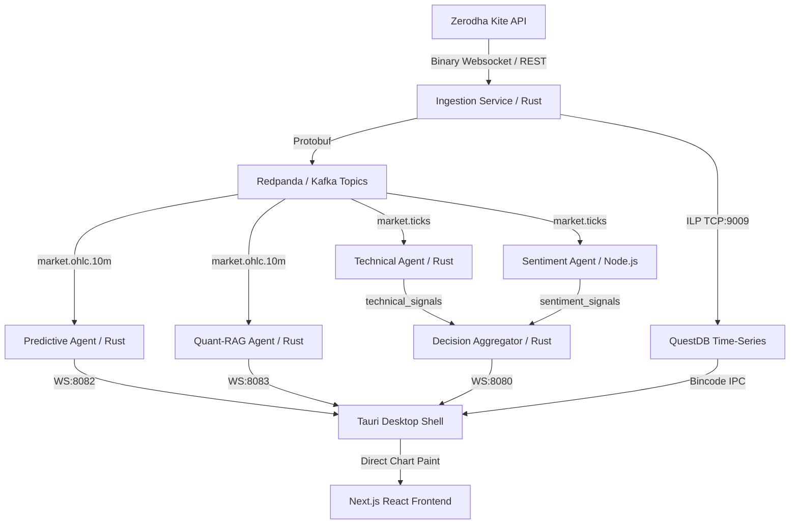

# Alpha Suite (Strat)

<p align="center">
  <strong>Bloomberg Terminal intelligence, built in Rust, for the serious Indian F&O trader.</strong>
</p>

<p align="center">
  
  
  
  
  
</p>

---

> [!IMPORTANT]
> **Strictly Private & Proprietary Codebase**  
> This software is the exclusive property of Yash Rana. All rights are reserved worldwide. Unauthorized copying, distribution, modification, reverse engineering, or usage of this software or any associated files is strictly prohibited under copyright laws. See [LICENSE.txt](file:///d:/projects/aitrader-landing/LICENSE.txt) for more details.

---

## 1. Executive Summary

**Alpha Suite (Strat)** is a native, high-performance desktop trading terminal tailored specifically for the Indian equity and F&O (Futures & Options) markets (NSE/BSE). By connecting to the **Zerodha Kite WebSocket** and REST APIs, the system ingests high-frequency binary tick data, routes it through an event bus, runs real-time quantitative calculations inside native Rust agents, aggregates consensus scores, and streams insights into a latency-optimized charting interface.

### Key Highlights:
* **Sub-50ms Tick Path:** Direct binary parsing of Zerodha 184-byte tick frames to internal protobuf messages, written directly to QuestDB at native speeds.
* **5-Agent Swarm Intelligence:** Technical, Sentiment, Predictive (OLS Ghost Line), Quant-RAG, and Aggregator agents run concurrently to evaluate market conditions.
* **Zero-Latency Visuals:** Chart updates bypass React state reconciliation, invoking the Lightweight Charts API directly to prevent browser layout thrashing and maintain constant 60 FPS updates.
* **Local Security Vault:** Zerodha Kite API keys are encrypted client-side using Argon2id key derivation and AES-256 in Tauri Stronghold. Credentials never touch external servers or public logs.

---

## 2. Platform Architecture & Services

The monorepo contains independent services structured for low coupling and maximum throughput:



### Monorepo Components Directory Map:
* **`/ingestion`**: decodes binary frames from Kite and streams to Redpanda and QuestDB.
* **`/alpha-terminal`**: aggregates raw tick events into clean tumbling 10-minute candles.
* **`/agents/technical`**: computes 16 indicators (RSI, VWAP, SMA/EMA, MACD) in Rust.
* **`/agents/sentiment`**: analyzes Google News RSS feeds using Claude/DeepSeek to produce confidence indices.
* **`/agents/predictive`**: runs rolling 14-period OLS linear regression (OLS Ghost Line).
* **`/agents/quant-rag`**: triggers on $\ge 2\%$ swings to generate LLM anomaly analysis via DeepSeek v4 Pro.
* **`/aggregator`**: fuses signals into clear consensus decisions (`BUY`, `SELL`, `HOLD`).
* **`/auth`**: production-complete auth backend supporting JWT, Google OAuth, PAN/Aadhaar KYC verification, and billing.
* **`/frontend`**: Tauri desktop shell wrapper enclosing a Next.js 14 charting interface.
* **`/design-system`**: structural visual CSS tokens and utility rules (authoritative UI styles).

---

## 3. Technology Stack & Ports

| Layer | Technology | Purpose | Port / Protocol |
|---|---|---|---|
| **Data Ingestion** | Rust + Tokio | Binary frame decoder | `wss://ws.kite.trade` |
| **Message Bus** | Redpanda (Kafka) | Event routing for agents | `19092` (Ext) / `29092` (Int) |
| **TSDB** | QuestDB | High-frequency candlestick storage | `9009` (ILP) / `8812` (SQL) |
| **Desktop Shell** | Tauri + Rust | OS integrations, SQLite, Stronghold | Native IPC |
| **UI Dashboard** | Next.js 14 + React | UI panels and Lightweight Charts | Next.js dev server |
| **Auth Db** | PostgreSQL | Auth, Billing, KYC schemas | `5890` |
| **Cache Store** | Redis 7 | User session caching | `6379` |
| **AI LLM Engine** | DeepSeek v4 Pro | Conviction execution analysis | NVIDIA NIM API (REST) |

---

## 4. Local Quick Start

### Prerequisites
* Rust Toolchain (stable)
* Node.js (v20+ recommended)
* Docker & Docker Compose
* Git

### Step 1: Clone the repository
This repository is hosted privately.
```bash
git clone https://github.com/yash-rana0101/strat.git
cd strat
```

### Step 2: Initialize Infrastructure Services
Spin up the required background services using Docker Compose:
```bash
docker-compose up -d
```
Verify all services are active:
* QuestDB Web Console: [http://localhost:9000](http://localhost:9000)
* Redis, PostgreSQL, and Redpanda instances are running.

### Step 3: Run in Local Simulation Mode
To run without active Kite credentials, use the Chaos Engine simulation mode:
```bash
# Set environment flag to bypass live connections
$env:ALPHA_TEST_MODE="true"  # PowerShell
# or
export ALPHA_TEST_MODE="true" # Unix
```

Start the simulation tool:
```bash
cargo run --bin load_tester
```

### Step 4: Boot Backend Services
Open distinct terminal instances to boot up the system services:
```bash
# Ingestion Client
cargo run --bin ingestion

# Candlestick Engine
cargo run --bin alpha-terminal

# Predictive Agent (Ghost Line)
cargo run --bin predictive

# Decision Engine
cargo run --bin aggregator
```

### Step 5: Start Desktop Application
```bash
cd frontend
npm install
npm run tauri dev
```

---

## 5. UI Design Guidelines & Visual Tokens

The frontend architecture adheres strictly to our core design spec defined in `DESIGN.md`. 
* **Primary Theme:** Deep Space Dark (`#080C14` background base).
* **Restrained Accent:** Electric Cyan (`#00D4FF`) highlights interactive triggers.
* **Signal Visuals:** Green (`#00E676`) is strictly reserved for bullish signals/BUY decisions, and Red (`#FF3D57`) is strictly reserved for bearish signals/SELL decisions.
* **Typography:** 
  * Displays: *Instrument Serif* (restricted to landing page Hero headings).
  * Main Interface: *Geist* and *DM Sans*.
  * Financial Metrics / Numbers: *JetBrains Mono* (monospaced to avoid visual shifting).
* **Motion:** 600ms ease-out-expo cubic-bezier transitions (`0.16, 1, 0.3, 1`) with native fallback disabling for `prefers-reduced-motion`.

---

## 6. Private Codebase Guidelines & Security

Please consult these additional documents before writing or committing code to this repository:
* [CODE_OF_CONDUCT.md](file:///d:/projects/aitrader-landing/CODE_OF_CONDUCT.md) — Fostering professional, secure, and respectful team operations.
* [CONTRIBUTING.md](file:///d:/projects/aitrader-landing/CONTRIBUTING.md) — Workflow descriptions, git standards, code reviews, and style compliance.
* [SECURITY.md](file:///d:/projects/aitrader-landing/SECURITY.md) — Encryption guarantees, Tauri Stronghold structures, and private vulnerability reporting protocols.
* [LICENSE.txt](file:///d:/projects/aitrader-landing/LICENSE.txt) — Ownership boundaries (Strictly All Rights Reserved).
