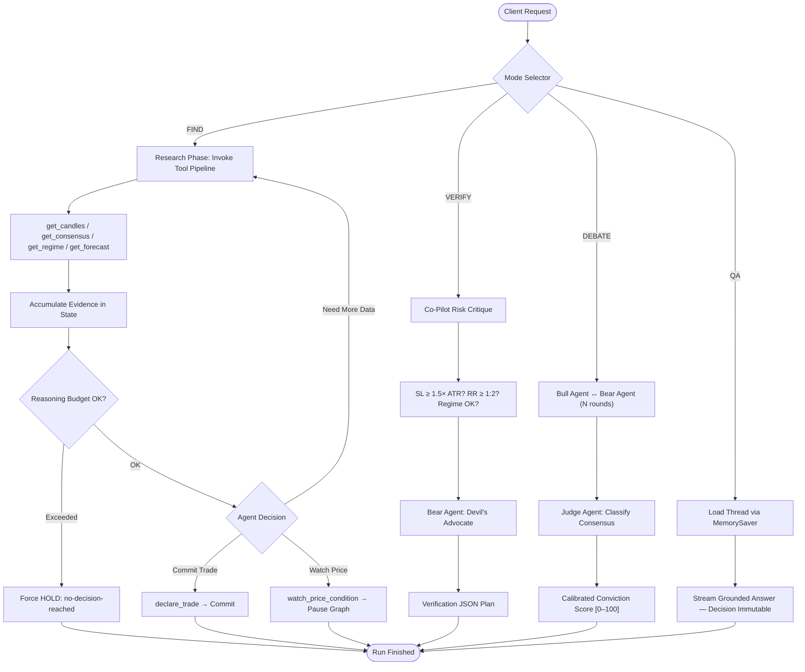

# 🌌 Strat — Institutional AI-Powered Quantitative Trading Terminal

Strat is a proprietary, institutional-grade, AI-driven quantitative trading platform purpose-built for NSE (National Stock Exchange of India) markets. It fuses sub-second Rust data ingestion, multi-agent LLM reasoning (LangGraph), property-tested mathematical analysis, real-time news sentiment, and a native desktop HUD into a single cohesive system. Every trading decision is grounded in live market microstructure, defended by a multi-agent debate framework, and streamed to the operator with full glass-box transparency.

> [!NOTE]
> This software is governed by a **Proprietary & Confidential License**. Unauthorized copying, distribution, reverse-engineering, or deployment is strictly prohibited. See [`LICENSE.txt`](LICENSE.txt) for full terms.

---

## Table of Contents

- [System Architecture](#-system-architecture--data-flow)
- [Core Execution Flow](#core-execution-flow)
- [Service Catalog](#-service-catalog)
- [Deep Quant Analytical Foundation](#-deep-quant-analytical-foundation)
- [LangGraph Reasoning Core](#-langgraph-stateful-agentic-reasoning-core)
- [Options Data Foundation (F&O)](#-options-data-foundation-fo-sync)
- [Protobuf Contracts](#-protobuf-data-contracts)
- [Paper Trading Engine](#-paper-trading-engine)
- [Desktop Terminal (Tauri + Next.js)](#-desktop-terminal--tauri--nextjs)
- [Testing Foundation](#-purity--property-based-testing-foundation)
- [Directory Map](#-complete-directory-map)
- [Developer Setup](#-developer-setup--deployment)
- [Environment Reference](#environment-variable-reference)

---

## 🏗️ System Architecture & Data Flow

Strat is built on a distributed, low-latency asynchronous architecture spanning **8 independent services** orchestrated across three languages:

| Layer | Language | Services |
|---|---|---|
| **Data Plane** | Rust | Ingestion, Technical Agent, Aggregator, Alpha-Terminal, Tool Server |
| **Reasoning Plane** | Python | Deep Quant Loop (LangGraph + FastAPI) |
| **Intelligence Plane** | Node.js | Sentiment Agent, Auth Service |
| **Presentation Plane** | Rust + React | Tauri Native Bridge + Next.js Frontend |

**Infrastructure Dependencies** (managed via `docker-compose.yml`):

| Service | Image | Ports | Role |
|---|---|---|---|
| **Redpanda** (Kafka) | `redpandadata/redpanda` | `19092` (external), `29092` (internal) | Event streaming backbone |
| **QuestDB** | `questdb/questdb` | `9000` (HTTP), `9009` (ILP), `8812` (Postgres) | Time-series tick storage |
| **Redis** | `redis:7-alpine` | `6379` | Sentiment cache & session store |
| **PostgreSQL** | `postgres:16-alpine` | `5432` | Auth & payment persistence |

```mermaid
graph TD
    %% ── Data Ingestion ──────────────────────────────────────────────
    subgraph Ingestion ["Data Ingestion & Control (Rust — Port 8085)"]
        Kite[Zerodha Kite WebSocket] -->|Binary Ticks| Ingest[ingestion service]
        IngestCtrl[TCP Control Server :8085] -->|Diff Subscriptions| Ingest
    end

    %% ── Storage ─────────────────────────────────────────────────────
    subgraph Storage ["High-Velocity Storage"]
        Kafka[("Redpanda / Kafka")]
        QDB[("QuestDB")]
        Redis[("Redis")]
    end
    Ingest -->|Protobuf Ticks → market.ticks| Kafka
    Ingest -->|ILP + SQL Inserts| QDB

    %% ── Analytical Agents ───────────────────────────────────────────
    subgraph Agents ["Quantitative Agents"]
        TechAgent["Technical Agent (Rust)"]
        SentAgent["Sentiment Agent (Node.js)"]
        Aggregator["Aggregator (Rust — Port 8080)"]
    end
    Kafka -->|market.ticks| TechAgent
    TechAgent -->|technical_signals| Kafka
    SentAgent -->|sentiment_signals| Kafka
    SentAgent -->|LLM Cache| Redis
    Kafka --> Aggregator
    Aggregator -->|trade_decisions + WebSocket| Tauri

    %% ── Reasoning ───────────────────────────────────────────────────
    subgraph Reasoning ["LangGraph Reasoning Loop (Python — Port 8086)"]
        DQL["Deep Quant Loop (FastAPI)"]
        ToolServer["Rust Tool Server :8084"]
    end
    Tauri -->|/run /resume /qa| DQL
    DQL <-->|get_candles / declare_trade| ToolServer
    ToolServer -->|Quant Computations| QDB
    DQL -->|SSE Event Stream| Tauri

    %% ── Desktop ─────────────────────────────────────────────────────
    subgraph Desktop ["Desktop Terminal (Tauri + Next.js)"]
        Tauri["Tauri Rust Core"]
        UI["React/Next.js HUD"]
        SQLite[("SQLite")]
    end
    Tauri <-->|IPC Commands| UI
    Tauri -->|Instrument Master| SQLite
    Tauri -->|PG Pool Queries| QDB

    style Ingestion fill:#1e1e2e,stroke:#313244,stroke-width:2px
    style Storage fill:#181825,stroke:#313244,stroke-width:2px
    style Agents fill:#1e1e2e,stroke:#313244,stroke-width:2px
    style Reasoning fill:#11111b,stroke:#a6e3a1,stroke-width:2px
    style Desktop fill:#181825,stroke:#89b4fa,stroke-width:2px
```



### Core Execution Flow

1. **Dynamic Ingestion Subscription** — The ingestion service boots with zero active subscriptions and listens on TCP port `8085`. The Tauri desktop client triggers subscriptions based on symbols active in the UI. Subscriptions are diffed on each update — only net-new tokens are subscribed and stale tokens are unsubscribed.

2. **Binary Tick Parsing** — High-speed tick data is ingested from Zerodha's Kite WebSocket API, decoded from its big-endian binary layout into Protobuf `Tick` messages, and routed by contract class:
   - **Equity Path**: Published to Kafka (`market.ticks`) and QuestDB (`live_ticks`).
   - **Option Path**: Processed in spawned async tasks → `option_ticks` table. A periodic background task writes `option_chain_snapshots`.

3. **Kafka Topic Pre-Creation** — The `ignition.sh` launcher pre-creates all four Kafka topics (`market.ticks`, `technical_signals`, `sentiment_signals`, `trade_decisions`) via `rpk` before any consumer starts, eliminating `UnknownTopicOrPartition` race conditions.

4. **Agent Signal Pipeline** — The Technical Agent (Rust) consumes raw ticks and produces indicator signals. The Sentiment Agent (Node.js) polls news APIs, classifies via LLM, and caches results in Redis. Both publish to Kafka.

5. **Aggregator Fusion** — The Rust Aggregator consumes both signal topics, applies configurable technical/sentiment weighting (default 70/30), and produces `AggregatedDecision` messages (BUY/SELL/HOLD + conviction score 1–100). Results are broadcast via WebSocket on port `8080`.

6. **Stateful ReAct Loop** — The Deep Quant Loop (FastAPI on port `8086`) runs a compiled LangGraph state machine. It invokes the Rust Tool Server (port `8084`) for market microstructure, regime classification, forecasting, and order flow analysis, then streams glass-box SSE events back to the desktop.

7. **Paper Trading Execution** — The Tauri native bridge maintains a `VirtualPortfolio` in memory. Each incoming tick is evaluated against open positions for stop-loss and take-profit triggers, with all state changes emitted to the React frontend in real time.

---

## 📦 Service Catalog

### 1. `ingestion/` — Rust Tick Ingestion Engine

**Language**: Rust &nbsp;|&nbsp; **Port**: `8085` (TCP Control)

The high-speed data gateway connecting Zerodha Kite's WebSocket feed to the platform's storage and streaming backbone.

- **Binary Decoding**: Parses Kite's proprietary big-endian binary tick format into internal structures.
- **Dual-Sink Routing**: Equity ticks → Kafka + QuestDB concurrently. Option ticks → isolated async tasks to prevent latency bleed.
- **TCP Control Protocol**: Accepts newline-delimited JSON commands (`subscribe`, `unsubscribe`, `option_chain_set`) for dynamic subscription management.
- **Kite Token Exchange**: Exchanges `KITE_REQUEST_TOKEN` for `KITE_ACCESS_TOKEN` at startup if needed (port `8087`).
- **Fault Isolation**: Option-side DB stalls never block the equity execution path.

**Key Dependencies**: `tokio`, `tungstenite`, `rdkafka`, `prost` (Protobuf), `tokio-postgres`, `questdb-rs`

### 2. `agents/technical/` — Rust Technical Indicator Agent

**Language**: Rust

Consumes raw ticks from Kafka and produces computed technical indicator signals.

- **Indicators**: RSI, Bollinger Bands, MACD, EMA crossovers.
- **Output**: Publishes Protobuf-encoded signals to `technical_signals` Kafka topic.

### 3. `agents/sentiment/` — Node.js Sentiment Analysis Agent

**Language**: Node.js &nbsp;|&nbsp; **Key Files**: `index.js`, `analyzer.js`, `claude.js`, `fetcher.js`, `strategicFetcher.js`

An autonomous news-driven intelligence pipeline that evaluates market sentiment in real time.

- **News Acquisition**: Polls NewsData.io (`fetcher.js`) and RSS feeds (`strategicFetcher.js`) for the latest headlines relevant to tracked symbols.
- **Company Profiling**: Enriches context with Finnhub financial profiles (`companyProfiles.js`, `profile.js`).
- **LLM Classification**: Routes headlines through an LLM (configurable — Gemini, Claude, or OpenAI) via `claude.js` to produce structured sentiment scores.
- **Redis Caching**: Deduplicates and caches evaluations to minimize API costs and prevent re-processing (`cache.js`).
- **Kafka Publishing**: Encodes results with Protobuf (`protoLoader.js`) and publishes to `sentiment_signals` topic.

### 4. `aggregator/` — Rust Signal Fusion & Decision Engine

**Language**: Rust &nbsp;|&nbsp; **Port**: `8080` (WebSocket)

The convergence point where technical and sentiment signals are fused into actionable trade decisions.

- **Weighted Fusion**: Combines technical and sentiment conviction scores using configurable weights (tracked in each `AggregatedDecision` as `technical_weight_used` / `sentiment_weight_used`).
- **Conflict Resolution**: When indicators diverge significantly, dynamic weighting shifts toward **HOLD / Capital Preservation**.
- **WebSocket Broadcast**: Streams `AggregatedDecision` messages to connected clients (primarily the Tauri frontend).

### 5. `agents/deep-quant-loop/` — Python LangGraph Reasoning Core

**Language**: Python &nbsp;|&nbsp; **Framework**: FastAPI + LangGraph &nbsp;|&nbsp; **Port**: `8086`

The brain of the system — a stateful, multi-agent LLM reasoning engine. See [detailed section below](#-langgraph-stateful-agentic-reasoning-core).

**Modules** (16 files, ~770K source):

| Module | Lines | Role |
|---|---|---|
| `graph.py` | ~4,800 | Compiled LangGraph state machine, system prompt, all node implementations |
| `tools.py` | ~3,100 | 20+ tool definitions with Pydantic contracts and honest-failure markers |
| `backtest.py` | ~2,200 | Historical simulation engine with bracket/trailing exit modeling |
| `journal.py` | ~1,400 | SQLite-backed trade journal, expectancy tracking, per-setup-type edge |
| `stream_events.py` | ~1,200 | Pure SSE event builders (REASONING, TOOL_CALL_*, DECISION, RUN_*) |
| `trade_manager.py` | ~1,100 | Multi-leg exit simulation, breakeven triggers, trailing stops |
| `order_flow.py` | ~1,000 | CVD, delta analysis, absorption/exhaustion detection, OFI |
| `rs.py` | ~900 | Relative Strength vs. benchmark, sector rotation, breadth analysis |
| `forecaster.py` | ~900 | Regime-aware directional forecast, up-probability, ATR-scaled move |
| `regime.py` | ~800 | Market regime classifier (trending/ranging/volatile/quiet) |
| `session.py` | ~600 | NSE timezone phases, expiry awareness, time favorability gating |
| `debate.py` | ~600 | Multi-agent Bull/Bear/Judge debate orchestration |
| `calibration.py` | ~350 | Conviction calibration from stance consensus |
| `validator.py` | ~500 | Co-pilot risk verification and bracket auditing |
| `main.py` | 184 | FastAPI entrypoint with `/run`, `/resume`, `/qa` endpoints |

### 6. `tools/` — Rust Quantitative Tool Server

**Language**: Rust &nbsp;|&nbsp; **Port**: `8084`

A local HTTP API server computing quantitative indicators on demand for the LangGraph agent:

- **VWAP** — Volume-Weighted Average Price
- **EMA** — Exponential Moving Averages (multiple periods)
- **Pivot S/R** — Support and Resistance via pivot calculations
- **Volume Profile** — Point of Control (POC), Value Area High (VAH), Value Area Low (VAL)
- **Candlestick Patterns** — 19 pattern detectors (engulfing, hammer, doji, morning star, etc.)
- **VWEPR** — Volume-Weighted Exponential Price Regression (proprietary quadratic curvature model)
- **Load Tester** — Stress-testing chaos engine with anomaly injector

### 7. `alpha-terminal/` — Rust OHLC Aggregator

**Language**: Rust

Real-time OHLC candle aggregation from raw ticks with a configurable window (default 10 minutes) and WebSocket broadcasting.

### 8. `alpha-backend/services/` — Node.js Platform Services

**Language**: Node.js

Backend microservices for platform operations (not trading logic):

- **`auth-service/`**: User authentication and session management (Redis-backed).
- **`payment-service/`**: Payment processing and subscription management (PostgreSQL-backed).

### 9. `backend/` — QuestDB Schema Migrations

SQL migration scripts for initializing and evolving the QuestDB time-series schema (`live_ticks`, `option_ticks`, `option_chain_snapshots`, `historical_candles`, `historical_intraday`).

---

## 🧠 Deep Quant Analytical Foundation

Strat's reasoning core is driven by a sophisticated multi-variable pipeline feeding into the **"Self-Defending Hunter" V3 System Prompt**. All indicators and market calculations are mathematically resolved in pure, side-effect-free modules and injected verbatim into the LLM context.

### 1. VWEPR (Volume-Weighted Exponential Price Regression) Curvature

The terminal utilizes the proprietary **VWEPR** regression system to predict support/resistance and trend exhaustion using polynomial fitting. A sliding window of historical bars is fit to a quadratic curve:

$$y = a x^2 + b x + c$$

Where:
- **$a > 0$ (Positive Curvature)**: Parabolic acceleration — accelerating bullish momentum.
- **$a < 0$ (Negative Curvature)**: Exhaustion curve / Rounding Top — high-probability momentum stall.
- The fitting matrix is solved using Cramer's rule determinant equations:

$$\det(A) = N(S_{x^2}S_{x^4} - S_{x^3}^2) - S_x(S_x S_{x^4} - S_{x^2}S_{x^3}) + S_{x^2}(S_x S_{x^3} - S_{x^2}^2)$$

### 2. Regime Classification (`regime.py`)

A pure mathematical classifier that categorizes the current market state:

| Regime | Condition | Trading Implication |
|---|---|---|
| **Trending** | ADX > threshold, aligned EMAs | Trend-following setups favored |
| **Ranging** | Low ADX, price oscillating in band | Mean-reversion setups favored |
| **Volatile** | High ATR expansion, wide Bollinger Bands | Reduced position sizing |
| **Quiet** | Compressed ATR, narrow bands | Breakout watch mode |

Uses: ADX, ATR, Bollinger Band width, EMA alignment, and historical volatility percentile.

### 3. Order Flow Analysis (`order_flow.py`)

Institutional-grade microstructure analysis:

- **Cumulative Volume Delta (CVD)**: Tracks aggressive buy vs. sell volume pressure.
- **Delta Analysis**: Per-bar buy/sell volume breakdown.
- **Absorption Detection**: Identifies large passive orders absorbing aggressive flow (institutional footprint).
- **Exhaustion Detection**: Flags volume climaxes signaling trend termination.
- **Order Flow Imbalance (OFI)**: Quantifies net order flow directionality.

### 4. Relative Strength Analysis (`rs.py`)

Compares individual instrument performance against benchmarks and sectors:

- **RS vs. Benchmark**: Relative performance ratio and momentum.
- **Sector Rotation**: Identifies sector-level capital flows.
- **Breadth Analysis**: Market-wide participation metrics.

### 5. Multi-Source Pipeline Fusion & Deduplication

Merges daily historical archives, intraday cached bars, and live tick aggregates:

$$\text{Candles} = \text{Daily Archive} \cup \text{Intraday Cache} \cup \text{Live Tick Aggregates}$$

Collision resolution by source priority: $\text{Live} > \text{Intraday} > \text{Daily}$.

---

## 🧠 LangGraph Stateful Agentic Reasoning Core

The reasoning layer runs as an independent FastAPI service (port `8086`) orchestrating a compiled LangGraph state machine with 4 operational modes and 3 HTTP endpoints.

### API Endpoints

| Endpoint | Method | Purpose |
|---|---|---|
| `/run` | POST | Start a new analysis run (FIND, VERIFY, or DEBATE mode) |
| `/resume` | POST | Resume a paused run (triggered candle arrived) |
| `/qa` | POST | Ask follow-up questions about a prior analysis |

### Operational Modes



#### `FIND` Mode — Directional Hunter
Scans the active chart timeframe. Walks the qualitative tool pipeline (macro bias, volume profiles, patterns, OLS, neural drift forecasts, regime, order flow) to identify A+ setups. Can commit a trade via `declare_trade` or suspend via `watch_price_condition` to wait for a specific price level before re-entering.

#### `VERIFY` Mode — Co-Pilot Risk Auditor
Evaluates a user-proposed trade bracket. Audits levels against live ATR volatility, Bollinger Bands, and S/R pivots. Runs a single-pass Bear Agent (Devil's Advocate) critique to identify hidden structural red flags.

#### `DEBATE` Mode — Multi-Agent Consensus
Spawns an internal debate where a **Bull Agent** and **Bear Agent** argue over gathered evidence (both bound to a read-only toolset — `declare_trade` is disabled). After N rounds, a **Judge Agent** classifies the consensus as `STRONG_FLOOR`, `STRONG_GAP`, or `CONTESTED_GAP` and derives a calibrated conviction score.

#### `QA` Mode — Interactive Auditing
Allows operators to ask follow-up questions about prior analyses. Answers are grounded in the thread's checkpointed session memory via `MemorySaver`. The active `Declared_Trade` remains **strictly immutable** — Q&A never modifies committed positions.

### Honest-Failure Markers

A foundational design principle: when an upstream tool fails (API timeout, unavailable data), the system returns an `{ "unavailable": true }` marker in the tool result instead of fabricating data or throwing an exception. The LLM then degrades gracefully, disclosing unavailability in its reasoning rather than hallucinating values.

### Glass-Box SSE Event Protocol

Every run streams ordered Server-Sent Events to the UI:

```
RUN_STARTED → [REASONING | TOOL_CALL_START | TOOL_CALL_RESULT | TOOL_CALL_END]* → RUN_FINISHED
```

- `TOOL_CALL_START` always precedes its corresponding `TOOL_CALL_RESULT` and `TOOL_CALL_END`.
- A failed LLM stream emits `ERROR` with no `DECISION` or `RUN_FINISHED` — the failure surfaces cleanly rather than producing a fabricated trade plan.
- If the reasoning budget is exhausted (default: 3 consecutive reasoning-only turns), the system forces `HOLD` with `no-decision-reached`.

### Trade Exits & Simulator (`trade_manager.py` & `journal.py`)

- **Managed Exit Simulation**: Models multi-leg target execution, stop-loss triggers, breakeven thresholds, and trailing stop offsets over historical candle arrays.
- **Trade Expectancy Audit**: SQLite-backed journal tracking win rate and expectancy (measured in $R$) overall and per setup type.
- **Calibrated Confidence**: Conviction is adjusted downward when the journal reports historically negative expectancy for comparable setups.

### Timezone-Aware Session Engine (`session.py`)

Maps trades to NSE exchange timezone (`Asia/Kolkata` / +05:30):

| Phase | Window | Characteristics |
|---|---|---|
| `pre_open` | Before 09:15 | No trading |
| `opening` | 09:15 – 09:30 | Violent mean-reversion, high volatility |
| `morning` | 09:30 – 11:30 | Primary trend development |
| `midday` | 11:30 – 13:30 | Thin volume, choppy action |
| `afternoon` | 13:30 – 14:30 | Institutional re-entry |
| `closing` | 14:30 – 15:30 | Position squaring, high volume |
| `post_close` | After 15:30 | No trading |

- **Expiry Awareness**: Detects weekly/monthly option expiry days and computes `days_until_expiry`.
- **Time Favorability Gating**: Labels window quality as favorable/unfavorable. Gating is non-blocking — the agent is warned but can proceed with explicit disclosure in the defensibility record.

---

## 🏛️ Options Data Foundation (F&O Sync)

Fully automated, end-to-end Options Data Foundation syncing derivatives contracts, resolving strike chains, and coordinating subscriptions.

### 1. Bounded Option Chain Resolution (`option_chain.rs`)
Pure, deterministic, clock-free library constructing the strike-ordered CE/PE ladder:

- **ATM Strike Selection**: Nearest listed strike to spot price (equidistant ties → lower strike).
- **Strike Band Window**: Contiguous, sorted, de-duplicated band bounded by configurable half-width $M$ (band size $\le 2M + 1$).
- **Nearest Expiries**: Filters the $N$ nearest non-expired expiry dates.
- **Bounded Selection**: Cross product (Expiries × Strikes × CE/PE) with rigid subscription limits.

### 2. Bounded Option Chain Subscriber (`option_chain_subscriber.rs`)
Background Tauri service linking the database to the ingestion control port:

- Polls QuestDB every 15 seconds for latest spot prices.
- Queries NFO contracts from SQLite `nfo_instruments` cache.
- Triggers TCP control updates only when ATM strike shifts past a configurable threshold.

### 3. Ingestion Subscription Diffing
The ingestion control server dynamically synchronizes active option subscriptions via delta diffs — subscribe new tokens, unsubscribe removed tokens, with fault-isolated option sinks preventing latency bleed into the equity path.

---

## 📡 Protobuf Data Contracts

All inter-service communication uses Protocol Buffers defined in `shared_protos/`:

### `market_data.proto`

```protobuf
message Tick {
  string symbol           = 1;   // NSE instrument symbol (e.g., "RELIANCE", "NIFTY 50")
  int64  timestamp_ms     = 2;   // Unix epoch milliseconds — exchange timestamp
  double last_traded_price = 3;  // LTP in INR
  int32  volume           = 4;   // Cumulative traded volume
  double best_bid         = 5;   // Top-of-book bid
  double best_ask         = 6;   // Top-of-book ask
  uint32 instrument_token = 7;
  double open / high / low / close = 8–11;
  optional uint64 open_interest = 12; // Present only for F&O full-mode packets
}

message OHLCCandle {
  string symbol = 1;
  uint64 start_timestamp_ms / end_timestamp_ms = 2–3;
  double open / high / low / close = 4–7;
  uint64 volume = 8;
}
```

### `decision.proto`

```protobuf
enum ActionType { BUY = 0; SELL = 1; HOLD = 2; }

message AggregatedDecision {
  string     symbol                = 1;
  int64      timestamp_ms          = 2;
  int32      final_conviction_score = 3;  // Weighted conviction (1–100)
  double     technical_weight_used = 4;   // 0.0 – 1.0
  double     sentiment_weight_used = 5;   // 0.0 – 1.0
  ActionType action_type           = 6;
}
```

---

## 💸 Paper Trading Engine

The Tauri native bridge includes a full paper-trading engine (`execution/paper.rs`) that simulates live trading without risking real capital:

- **Fixed Risk Model**: Every paper trade risks exactly **2% of portfolio balance** on the stop-loss distance: $\text{Qty} = \lfloor \frac{0.02 \times \text{Balance}}{|Entry - SL|} \rceil$
- **Real-Time Position Monitoring**: Each incoming tick is evaluated against all open positions. Positions auto-close when price hits SL or TP.
- **Instant UI Updates**: Portfolio state changes are emitted via Tauri events (`paper_portfolio_update`) for immediate React rendering.
- **Position States**: `OPEN` → `CLOSED_WIN` | `CLOSED_LOSS`
- **Balance Tracking**: Running P&L calculated on each closure.

---

## 🖥️ Desktop Terminal — Tauri + Next.js

A native desktop application combining Rust backend power with a React-based HUD.

### Tauri Rust Core (`frontend/src-tauri/`)

- **Instrument Master Sync**: SQLite-backed instrument database with bulk sync from Kite API.
- **Option Chain Subscriber**: Background task polling spot prices and managing F&O subscriptions.
- **Paper Trading Engine**: Virtual portfolio with tick-by-tick position evaluation.
- **QuestDB Connection Pool**: PostgreSQL pool for historical candle queries.
- **IPC Commands**: Exposes 20+ Tauri commands to the React layer.

### React Frontend (`frontend/src/`)

**Layout Profiles**:
| Layout | File | Purpose |
|---|---|---|
| `IntradayLayout` | Scalping & day-trading dashboard |
| `SwingLayout` | Multi-day position management |
| `InvestorLayout` | Long-term portfolio view |

**Key Component Areas**:
- `components/quant/deep-quant/` — AI execution plan view, multi-TF pattern display, verification form
- `components/panels/left-panel/` — Live asset HUD, sentiment block
- `components/broker/` — Broker connection card (Zerodha OAuth)
- `components/settings/` — Security vault configuration
- `components/charts/` — HTML5 Canvas chart overlays (Volume Profile, Level-2 Footprint)

**State Management** (Zustand):
- `useTradeStore` — Live trade telemetry and position tracking.
- `useQuantStore` — Quantitative analysis state and indicator data.
- `useChartUIStore` — Chart drawing tools, indicators, visibility toggles.

**Testing**:
- E2E tests: `frontend/tests/e2e.spec.ts`
- Tauri integration tests: `api_tests.rs`, `quant_tests.rs`
- Store property tests: 6 test files covering chart UI invariants, immutability, and interaction contracts.

---

## 🧪 Purity & Property-Based Testing Foundation

The platform adopts a strict **purity-first design**: all quantitative calculations, configurations, and state decisions are extracted into pure, side-effect-free functions testable against arbitrary boundaries.

### Test Coverage Summary

| Layer | Framework | Test Count | Focus |
|---|---|---|---|
| **Deep Quant Loop** | `pytest` + `hypothesis` | **278 files** | Property-based testing across all pure modules |
| **Tauri Rust Core** | `cargo test` + `proptest` | 2 test modules | API integration + quant computation verification |
| **Zustand Stores** | `vitest` | 6 test files | State invariants, immutability, interaction contracts |
| **Frontend E2E** | Playwright | 1 comprehensive spec | Full user flow validation |

### What's Property-Tested

- **Regime Classification**: Correct regime assignment over thousands of randomly generated market conditions.
- **Order Flow Analysis**: CVD, delta, absorption, and exhaustion detection under synthetic tick sequences.
- **Session & Expiry**: Timezone mapping, minutes-since-open, expiry detection — no offset or lookahead bias.
- **Trade Manager Exits**: Simulated bracket exits, stop adjustments, and trailing fills under random price walks.
- **Debate & Calibration**: Judge decision loops, conviction calibration, stance parsing over generated inputs.
- **Option Chain Resolution**: Strike band contiguity, ATM selection, expiry filtering with random walk candles.
- **SSE Stream Ordering**: Event protocol invariants — RUN_STARTED always first, no DECISION after ERROR.
- **F&O Config Totality**: `resolve_fno_config` never panics regardless of environment variable state.
- **Honest Failure Markers**: Tool failures produce `unavailable: true` markers, never fabricated data.

---

## 📂 Complete Directory Map

```text
Ai-trader/
├── agents/
│   ├── deep-quant-loop/          # LangGraph FastAPI reasoning service (Python)
│   │   ├── graph.py              # Compiled state machine, system prompt, all nodes
│   │   ├── tools.py              # 20+ tool definitions with Pydantic contracts
│   │   ├── backtest.py           # Historical simulation engine
│   │   ├── journal.py            # SQLite trade journal & expectancy tracker
│   │   ├── trade_manager.py      # Multi-leg exit simulation
│   │   ├── order_flow.py         # CVD, delta, absorption, OFI analysis
│   │   ├── rs.py                 # Relative strength & sector rotation
│   │   ├── forecaster.py         # Regime-aware directional forecaster
│   │   ├── regime.py             # Market regime classifier
│   │   ├── session.py            # NSE timezone phases & expiry awareness
│   │   ├── debate.py             # Multi-agent Bull/Bear/Judge debate
│   │   ├── calibration.py        # Conviction calibration from consensus
│   │   ├── validator.py          # Co-pilot risk verification
│   │   ├── stream_events.py      # Pure SSE event builders
│   │   ├── main.py               # FastAPI entrypoint (/run, /resume, /qa)
│   │   ├── requirements.txt      # Python dependencies
│   │   └── tests/                # 278 property-based test files (Hypothesis)
│   ├── technical/                # Rust technical indicator agent (RSI, BB, MACD, EMA)
│   ├── predictive/               # Rust OLS & linear regression projection engine
│   ├── quant-rag/                # DeepSeek anomaly analysis (NVIDIA NIM)
│   └── sentiment/                # Node.js news sentiment pipeline
│       ├── src/
│       │   ├── index.js          # Main entry point & orchestration
│       │   ├── analyzer.js       # Sentiment score computation
│       │   ├── claude.js         # LLM classification interface
│       │   ├── fetcher.js        # NewsData.io API client
│       │   ├── strategicFetcher.js # RSS & strategic news fetcher
│       │   ├── companyProfiles.js # Company profile enrichment
│       │   ├── cache.js          # Redis dedup & caching
│       │   ├── kafkaProducer.js  # Kafka publisher
│       │   └── protoLoader.js    # Protobuf schema loader
│       └── package.json
├── aggregator/                   # Rust signal fusion & WebSocket broadcaster (port 8080)
├── alpha-terminal/               # Rust OHLC 10m aggregation & WS broadcast
├── alpha-backend/
│   └── services/
│       ├── auth-service/         # Node.js authentication service
│       └── payment-service/      # Node.js payment processing
├── backend/                      # QuestDB schema migration runner
├── ingestion/                    # Rust binary tick ingestion (port 8085)
├── tools/                        # Rust quant tool server (port 8084) + load tester
├── shared_protos/                # Protobuf schemas
│   ├── market_data.proto         # Tick & OHLCCandle messages
│   └── decision.proto            # AggregatedDecision & ActionType
├── frontend/
│   ├── src-tauri/                # Tauri Rust native bridge
│   │   ├── src/
│   │   │   ├── execution/paper.rs # Paper trading engine
│   │   │   ├── quant/            # Option chain resolver & subscriber
│   │   │   └── ...               # IPC commands, DB connections
│   │   └── tests/                # Rust integration tests
│   ├── src/
│   │   ├── app/                  # Next.js pages & routing
│   │   ├── store/                # Zustand state (trade, quant, chartUI)
│   │   │   └── __tests__/        # Store property tests
│   │   └── components/
│   │       ├── layouts/          # Intraday, Swing, Investor layouts
│   │       ├── quant/deep-quant/ # AI execution plan, patterns, verification
│   │       ├── panels/left-panel/ # Live HUD, sentiment block
│   │       ├── broker/           # Zerodha broker connection
│   │       ├── settings/         # Security vault
│   │       └── charts/           # Canvas chart overlays
│   ├── tests/                    # Playwright E2E tests
│   └── package.json
├── scripts/
│   └── powershell/               # Windows automation scripts
│       ├── start_system.ps1      # Full system launcher (Windows)
│       ├── infra.ps1             # Infrastructure start
│       ├── backend.ps1           # Backend services start
│       ├── frontend.ps1          # Frontend start
│       ├── auth.ps1              # Auth service start
│       └── stop-infra.ps1        # Infrastructure teardown
├── docker-compose.yml            # Infrastructure stack (Redpanda, QuestDB, Redis, Postgres)
├── ignition.sh                   # One-command system launcher (Linux/macOS)
├── .env.example                  # Environment variable template
├── LICENSE.txt                   # Proprietary & Confidential License
└── README.md                     # ← You are here
```

---

## 🛠️ Developer Setup & Deployment

### Prerequisites

- **Rust**: `rustup` with stable toolchain
- **Node.js**: v18+ with npm
- **Python**: 3.10+ with pip
- **Docker & Docker Compose**: For infrastructure services
- **Tauri Prerequisites**: System dependencies per [Tauri docs](https://v2.tauri.app/start/prerequisites/)

### 1. Environment Configuration

```bash
cp .env.example .env
# Fill in your API keys (see Environment Variable Reference below)
```

### 2. One-Command Launch (Linux/macOS)

```bash
chmod +x ignition.sh
./ignition.sh
```

This will:
1. Load `.env` variables
2. Start Docker infrastructure (Redpanda, QuestDB, Redis, Postgres)
3. Wait 15s for initialization
4. Pre-create Kafka topics via `rpk`
5. Launch services in dependency order: Auth → Ingestion → Technical Agent → Sentiment Agent → Aggregator → Frontend

**Stop everything**: `Ctrl+C` (gracefully terminates all services and runs `docker-compose down`)

### 2b. Windows Launch

```powershell
cd scripts\powershell
.\start_system.ps1
```

### 3. Manual Service-by-Service Launch

```bash
# Step 1: Infrastructure
docker-compose up -d

# Step 2: Deep Quant ReAct Agent (port 8086)
cd agents/deep-quant-loop
pip install -r requirements.txt
python main.py

# Step 3: Rust Ingestion (port 8085)
cd ingestion
cargo run --release

# Step 4: Sentiment Agent
cd agents/sentiment
npm install && npm start

# Step 5: Aggregator (WebSocket port 8080)
cd aggregator
cargo run --release

# Step 6: Desktop Terminal (Tauri + Next.js)
cd frontend
npm install
npm run tauri dev
```

### 4. Run Tests

```bash
# Python property tests (278 test files)
cd agents/deep-quant-loop
pytest tests/

# Rust integration tests
cd frontend/src-tauri
cargo test

# Frontend store tests
cd frontend
npm test

# E2E tests
cd frontend
npx playwright test
```

---

### Environment Variable Reference

| Variable | Required | Used By | Description |
|---|---|---|---|
| `KITE_API_KEY` | ✅ | Ingestion, Tauri | Zerodha Kite Connect API key |
| `KITE_API_SECRET` | ✅ | Ingestion | Kite API secret for token exchange |
| `KITE_ACCESS_TOKEN` | ⚠️ | Ingestion, Tauri | Daily access token (resets at midnight IST) |
| `KITE_REQUEST_TOKEN` | ⚠️ | Ingestion | OAuth request token (alternative to access token) |
| `LLM_API_URL` | ✅ | DQL, Sentiment | LLM endpoint (OpenAI-compatible) |
| `LLM_API_KEY` | ✅ | DQL, Sentiment | LLM API key |
| `LLM_MODEL` | ✅ | DQL, Sentiment | Model name (default: `gemini-2.5-flash`) |
| `NEWSDATA_API_KEY` | ✅ | Sentiment | NewsData.io API key |
| `FINNHUB_API_KEY` | ⬜ | Sentiment | Finnhub API key (best-effort enrichment) |
| `KAFKA_BROKER_URL` | ✅ | All agents | Kafka broker address (default: `localhost:19092`) |
| `QUESTDB_POSTGRES_URL` | ✅ | Ingestion, Tauri | QuestDB Postgres wire protocol URL |
| `QUESTDB_ILP_ADDR` | ✅ | Ingestion | QuestDB InfluxDB Line Protocol address |
| `REDIS_URL` | ✅ | Sentiment, Auth | Redis connection URL |
| `WEBSOCKET_PORT` | ⬜ | Aggregator | WebSocket server port (default: `8080`) |
| `INGESTION_CONTROL_PORT` | ⬜ | Ingestion | TCP control port (default: `8085`) |
| `KITE_API_PORT` | ⬜ | Ingestion | Kite token exchange port (default: `8087`) |

> **Legend**: ✅ Required &nbsp;|&nbsp; ⚠️ One of pair required &nbsp;|&nbsp; ⬜ Optional (has default)

---

> [!IMPORTANT]
> **Dynamic Weighting Conflict Resolution**: When technical indicators diverge significantly from sentiment scores, the aggregator applies dynamic weighting multipliers, shifting toward **HOLD / Capital Preservation** to prevent trade execution on unconfirmed setups. This is the system's primary self-defense mechanism against conflicting signals.

> [!CAUTION]
> **Configuration Sensitivity**: The Python-based Deep Quant Loop reads environment variables from the root `.env` at import time. Changes to `LLM_API_KEY`, `LLM_MODEL`, or `LLM_API_URL` require a service restart to take effect.